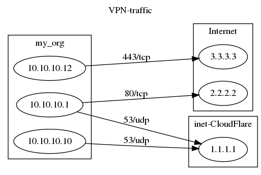

# JABS - Just automating boring stuff

Small collection of utilities for enriching/filtering log-files

  - dfm - dataframe manipulation
  - namedrop - drop names/info found by ipv4 adresses in ip-lookup
    tables (csv)
  - ls.ifaces - get list of interfaces with properties from cisco config
    files
  - heatmap - turn specific syslogs into a heatmap for a bunch of
    interfaces

Run

    # If pytest not installed yet:
    $ sudo pip3 install -U pytest
    
    # Then move to test-subdir of jabs project and run pytest:
    cd ~/dev/jabs/test
    pytest

# Usage

## dfm

### dfm - dfm command ...

information:
    read, manipulate and write datasets using pandas

description:

    Read a dataset from disk, apply various commands and write results to stdout
    or a given filename.
    
    dfm r:logs.csv svpn=ipl:vpn_nets,src_ip w:logs-named.csv
    
    dfm executes the commands left-to-right and reads the logs.csv file into a
    pandas dataframe, then it applies an iplookup on src_ip in a network table
    named vpn_nets[.csv] and assigns any name found to a new column svpn.  This
    basically adds a column to the logs, listing the vpn's the src_ip address
    belongs to.
    
    dfm help:         - will list all available commands
    dfm help:cmd,..   - lists help on the commands listed.
    
    All commands more or less follow the convention:
    
    f1,..=func:a1,...
    
    The columns to create/modify on the left-hand-side, and the command
    arguments on the right-hand-side.  Each command checks its arguments and
    interprets them in a way that hopefully makes sense for that particular
    command.  For some commands lhs/rhs fields are optional or forbidden.
    
    Some further examples are:
    
    dfm r:people.csv email~/\.eu$/      - lists people w/ eu emails
    dfm r:people.csv name=join:-,first,last - new column with first-last names
    dfm r:people.csv name,phone         - lists only the name and phone columns
    dfm r:people.csv age=inrange:10,19  - list the teens
    dfm r:people.csv age=gte:20         - 20 years or older
    dfm r:people.csv eyes=in:blue,green - people with blue or green eyes
    dfm r:people.csv name,phone w:cell.csv - create cell.csv w/ only 2 fields
    dfm help:                           - lists all available commands
    dfm help:nan,ipl                    - list help for two commands
    
    dfm makes it possible to:
    - add columns to csv-data using lookups (e.g using longest prefix matches)
    - cut columns from the csv-data
    - count rows using a groupby some columns
    - sum an existing count using a groupby some columns
    - filter rows using a regular expression
    - filter rows using lte,gte,inrange numeric expressions
    - filter rows using a simple value list
    - forward/backward fill columns using known good values
    
    All of which can be done using other tools, but using those usually required
    privileges outside my reach or a lot of repetitive manual labor.

## dfm example

Show traffic from some systems:

    #!/bin/bash
    
    SUBNETS=example/subnets.csv
    
    LOGS=example/logs.csv
    DOTF=${LOGS%.csv}.dot
    VPNF=${LOGS%.csv}+vpns.csv
    IMGF=$1
    
    # read $LOG -> write enriched logs to $VPNF and dotify to $DOTF
    # then turn dot-file into image
    
    dfm r:$LOGS \
        src_vpn=ipl:$SUBNETS,src,vpn \
        dst_vpn=ipl:$SUBNETS,dst,vpn \
        src,dst,srv,count,src_vpn,dst_vpn=keep: \
        count=sum: \
        w:$VPNF \
        $DOTF,VPN-traffic=dotify:src_vpn^src,dst_vpn^dst,srv \
        -v -d
    
    dot -Tpng $DOTF -o $IMGF

where `example/logs.csv` contains:

#!/bin/bash
cat example/logs.csv

which is enriched, using `example/subnets.csv` with vpn information:

#!/bin/bash
cat example/logs+vpns.csv

which in turn, is converted into a graphviz file containing:

#!/bin/bash
cat example/logs.dot

which is converted to an image by the `dot` command. Although cute and
perhaps sometimes useful, it gets pretty messy, pretty fast if the
number of hosts or number of sessions gets large.

# Documentation

## dfm (sub)commands

`dfm` allows commandline manipulation of a log file read into a pandas
dataframe. Add, delete, keep columns or filter rows based on a regex.
Rows can be filtered using a regex on columns or an ip filter.

### add - fx=add:fy,fz,..

information:
    add fields after mapping them to numbers

description:

    Create new column fx (or overwrite existing one) by add the
    values of columns fy,fz,.. after converting them to int(s)
    A field value that fails to convert, defaults to nan.
    
    Only 1 lhs-field is allowed and a minimum of 2 rhs-fields are
    required.  All rhs-fiels must be existing fields in the dataframe.

### copy - fx,..=copy:fy,..

information:
    copy fy,.. over to fx,..

description:

    Assign the values of the rhs-columns to the lhs-columns, possibly
    creating new columns or overwrite existing ones.  The lhs-fields
    fx,.. correspond 1-on-1 to the rhs-fields fy,.. so both sides need
    to list the same number of columns.  All rhs-fields must exist.
    
    Example:
    newCol,oldCol=copy:f1,f2  - df[newCol]=df[f1] and df[oldCol]=df[f2]

### del - fx,..=del:

information:
    delete fx,.. fields

description:

    Delete some specifically named fields.

### dotify - fname[,title]=dotify:srcs,dsts[,attrs]

information:
    write a dotfile to file 'fname' using src,dst fields

description:

    'dotify:' will write a 'fname' file using srcs,dsts to define the
    graph, possible using attrs to decorate edges.
    
    `srcs`=[fx^[fy]]^fz  is split on '^' to find 1 or more fields to use
    as source nodes of the graph.  The last field will create the actual
    node, any preceeding fields will be used to encapsulate the node in a
    subgraph named cluster_fy, which is then enclosed in cluster_fx and so
    on. All fields used in `srcs` must exist in the dataframe.
    
    `dsts`=[fb^[fc^]]fd  is treated likewise, but for destiation nodes.
    
    `attrs` is also split on '^' and should list label and/or edge
    attriutes.
    
    Example:
    
    apps.dot,web-traffic=dot:sorg^svpn^src_net,dorg^dvpn^dst_net,service^edge
    
    This would create source nodes form the src_net df-column, using
    the svpn and sorg for enveloping.  Likewise for dst_net, dvpn and
    dorg.  The attrs 'service^edge' takes the 'service' column as label
    fr edges and puts the 'edge' field as edge attributes, so it should
    contain values like 'color=blue', i.e. a string listing valid dot
    edge attributes separated by spaces.

### gte - fx,..=gte:v1

information:
    rows where any lhs-field >= v1

description:

    'gte:' will keep rows where any lhs-field has a value greater then, or
    equal to v1. All lhs-fields must be numeric and must exist.

### help - help:[cmd,..]

information:
    print help documentation and exit

description:

    'help:' will print documentation for all available commands, or just
    for those listed.  This command takes precedence over all other
    commands in the command stream on the cli.  That is, if given only
    this command will run and the program terminates with exit(0).

### in - fx,..=in:v1,..

information:
    select rows where any lhs-field has a value in the rhs-list

description:

    'in:' will keep rows where at least one of the lhs-fields, which all
    must exist, has a value listed in the rhs-list of values.
    
    Example:
    color=in:green,yellow  - keep only the green or yellow ones
    f1,f2=in:apple,pear - keep rows with apple and/or pear in f1 or f2

### info - info:

information:
    prints information about current invocation and exits

description:

    When called, 'info:' will print out information about how the
    program was called and what the command stream looks like.  This may
    be helpful to check how a command line invocation is being
    interpreted.  Note that this command takes precedence over all other
    commands except 'help'.  'info:' also terminates with exit(0).

### inrange - fx,..=inrange:v1,v2

information:
    select rows where v1 <= any lhs-field <= v2

description:

    'inrange:' keeps rows where any lhs-field is in range[v1,v2].
    There should be 2 rhs-fields giving the minimum and maximum values for
    the range.  Note that the lhs-fields must be numeric and must exist.

### ipf - [fx,..]=ipf:filter[.csv],src,dst[,srv]

information:
    filter rows and add columns based on a matching rule

description:

    'ipf:' loads the rule-set given by filter.csv and uses the listed
    src,dst,port-fields to try and match them against the filter.  The
    filter is cached in case the same filter is used again for tagging
    instead of filtering (or vice versa).
    
    If no lhs-field fx is given, rows with a negative match will be
    filtered out.  Otherwise, the tag from the first rule to match will
    be assigned to fx.
    
    The rhs-fields, except the first one which should refer to an
    existing filter file on disk, should be existing columns in the
    dataframe.
    
    The filter[.csv] file should list a rule-base with columns:
    rule, src_ip, dest_ip, dest_port, action, tag.  Something like:
    
    rule,src_ip,dest_ip,dest_port,action,tag
    1,10/8,10.10.10.10,80/tcp,permit,intranet1
    2,10/8,10.10.10.11,5000-6000/tcp,deny,drop-rule1
    ,10/8,10.10.10.12,,,
    3,any,any,any,deny,generic-drop
    
    Example:
    tag=ipf:myfilter,my_src,my_dest,dport         # dport is eg 80/tcp
    tag=ipf:myfilter,my_src,my_dest,dport,dproto  # dport,dproto = 80,17

### ipfget - fx[,..]=ipfget:filter[.csv],src,dst,srv,gx[,..]

information:
    get filter match object's data-fields gx,.. and assign to fx,..

description:

    'ipfget:' loads the rule-set given by filter.csv and uses the listed
    src,dst,service fields to try and match them against the filter.  The
    filter is cached in case the same filter is used again later on.
    
    Any existing lhs-fields will be overwritten and created otherwise.
    
    The rhs-fields must specify the columns to use for src ip,
    destination ip and service, followed by the fields to retrieve from
    the match object as specified by the ipf-filter.  All rhs-fields must
    exist, either in the dataframe (the first 3) or in het match object
    returned by the filter.  So its handy if the extra datafields of the
    filter are known (see below).
    
    An ipf filter is a csv file with mandatory fields:
    rule,src,dst,srv followed by optional data fields.
    
    The match object's data fields can be retrieved using ipfget:
    
    
    my_tag,my_attr=ipfget:file.csv,src,dst,service,tag,attr

### ipl - fx,..=ipl:table,fy,g1,..

information:
    ip lookup fy in 'table', get g1,.. & assign to fx,..

description:

    'ipl:' uses the ip address or prefix in fy, to index into an ip
    lookup 'table'. From the data columns found, it will assign g1,.. to
    the dataframe columns listed in fx,... which must all exist.
    
    Example:
    sname=ipl:hosts,src_ip,hostname
    : Assumung hosts[.csv] contains at least an ip-column and hostname
    : as column, use the 'src_ip' field to lookup the associated
    : hostname and assign that value to a (possibly) new field 'sname'.
    
    snetwork,svpn=ipl:routes,src_ip,subnet,vpn
    : Assuming routes contains at least subnet,vpn use the 'src_ip' field
    : to lookup any associated subnet and vpn information and assign
    : those values to snetwork and svpn respectively.
    
    Note that 'table' is read from disk and then cached for future uses
    in the command stream on the cli.  The first column that parses as an
    ip addres of prefix is used as the index column for the table.
    The table name (with or without .csv) must correspond to a file on
    disk in csv-format.
    
    The index-field (2nd value in rhs-list) must exist in the dataframe
    and should be a string representing an ip address of prefix
    (a.b.c.d/len).  Shorthand notations like 10/8 are allowed.

### join - fx=join:sep,fy,fz,..

information:
    join 2+ fields using sep

description:

    Create new column fx (or overwrite existing one) by joining the
    string values of columns fy,fz,.. using the string <sep>.
    
    Only 1 lhs-field is allowed and a minimum of 3 rhs-fields are
    required.  All rhs-fiels, except the <sep>-string must be existing
    fields in the dataframe.
    
    Example:
    |  a num
    |  a 1
    |  a 2
    
    Using b=join:\:a,num will get you
    
    |  a num b
    |  a 1   a:1
    |  a 2   a:2
    
    Usually you'll need to double the escape ''-char on the command
    line. (note: ':~=' are special characters for the command parser).

### keep - fx,..[=keep:[fy,..]]

information:
    keep only fx,.. fields or keep fy,.. fields & rename to fx,..

description:

    Discard all columns except the ones listed.  The command name 'keep:'
    is optional (is used by default if no command is given), in which case
    all lhs-fiels must exist.
    
    If rhs-fields are used, then all other columns are discarded after
    which the columns are renamed to lhs-fieldnames.  In this case there
    is a 1-on-1 correspondence between lhs- and rhs-fields.
    
    Example:
    name,age=keep:  - keep only these two columns
    name,age        - same effect
    name,age=keep:Name,Years - keep Name,Years & rename to name,age

### list - fx=concat:fy[..]

information:
    summarize on all columns except fy and concat those into fx

description:

    If rhs-fields are listed, all other fields/columns are discarded and
    rows are grouped on the remaining columns listed in the rhs.
    Otherwise rows are grouped using all available columns.  Note that any
    listed rhs-field must exist in the dataframe.
    
    if a lhs-field is given, its values are concatenated for each group and
    assigned to this column.  Otherwise, a new column is created and the
    assigned value will be a count of similar rows in the groups.
    
    Example:
    
    |  host  error  count  - sample dataframe
    |  A     down   12
    |  B     crash  3
    |  A     crash  4
    |  B     down   6
    |  A     crash  3
    |  B     down   8
    
    events=concat:host     - seen is count of host occurrences
    
    |  host events
    |  A    down 12, crash 4, crash 3
    |  B    crash 3, down 6, down 8
    
    
    events=concat:host,error   - total amount of host,error combinations
    
    |  host error events
    |  A    crash 4, 3
    |  A    down  12
    |  B    crash 3
    |  B    down  6, 8

### lower - fx,..=lower:[fy,..]

information:
    lower-case fields or assign lower(fy),.. to fx,..'

description:

    'lower:' will lowercase all the lhs-fields if no rhs-fields are
    given. In this case, all lhs-fields must exist.
    
    If rhs-fields are used, however, their lower-cased values are
    assigned to the lhs-fields in a 1-on-1 correspondence.  In this case
    the rhs-fields must all exist and any non-existing lhs-fields will be
    created.
    
    Example:
    name,last=lower: - will lower-case existing fields name,lower
    host=lower:name - creates new column host with lowercased name
    a,b=lower:c,c   - creates/sets columns a,b to lowercased value of c

### lte - fx,..=lte:v1

information:
    rows where any lhs-field <= v1

description:

    'lte:' will keep rows where any lhs-field has a value less then, or
    equal to v1. All lhs-fields must be numeric and must exist.

### map - fx,..=map:fy

information:
    create (fy,fx)-map and apply to existing fx,..

description:

    'map:' is a sort of forced forward/backward fill, using column fy to
    create a dictionary of fy->fx valid-values-mapping (retaining first mapping
    found) and them apply that to column fx.  The process is repeated for
    any additional lhs-fields, which must all exist.
    
    Only fx-nan-values are replaced by a known fx-valid-value given the
    value of fy in that row.
    
    Example:
    
    |  hostname      ip            count
    |  nan           68.178.213.61  10
    |  www.ietf.com  68.178.213.61  12
    
    Using hostname=map:ip, will get you:
    
    |  hostname      ip            count
    |  www.ietf.com  68.178.213.61  10
    |  www.ietf.com  68.178.213.61  12
    
    Mostly useful when the dataset is derived from events with common
    fields, but where not all events have all the fields all the time.

### nan - [fx,..=]nan:s1,..

information:
    replace values s<x> with null value in dst/all fields

description:

    'nan:' will replace listed string values with a np.nan value in the
    dataframe.  Either in all columns, or just in the ones listed in the
    lhs-field list.  The rhs-list is a csv-list of string values to
    replace with np.nan.
    
    Usefull if the dataset has some fixed 'filler' values you want to get
    rid of in order to drop them later on or have them replaced by the
    map: command.

### portstr - fx=port:fy,fz

information:
    turn fy,fyz (port, protocol numbers, eg 80,6) into a portstring like 80/tcp

description:

    Sometimes is better to get just port, protocol nr from the logs and
    convert those to a ipv4-port/service using the iana assigned numbers.
    portstr: does exactly that.
    
    Example:
    dfm r:logs service=port:port,proto
    
    The above will create/overwrite columns 'service' with a port string
    constructed from the port number and protocol number:
    
    service,port,proto
    80/tcp,"80","6"
    53/udp,53,17

### r - r:f,...

information:
    r is short for read, reads 1+csv-file(s)

description:

    see read

### read - read:f,..

information:
    discard any existing dataframe and load new one from 1+ csv-files

description:

    Loads data from csv-file(s), rhs-fields may list files or
    glob-patterns.
    
    rmany:a.csv,b*.csv  - read a.csv and all b-csv's into 1 dataframe.
    rmany:a,b*          - same thing, .csv extension is tested for as well
    
    Note that strange things may happen if the csv-files have different
    column names.
    
    For convenience, the abbreviation r: is an alias for rmany.

### recent - fx[,..]=seen:fz

information:
    sort by fz, groupby fy[,..] most recent records

description:

    Example:
    seen=recent:usrName,usrGSM

### regex - [fx=]fy~/abc/[ABC/][i]

information:
    create/modify fx or filter by fy

description:

    'regex:' can be used to either:
    - filter rows by matching fy to a regular expression
    - perform a substitution on fy via a regular expression, or
    - assign the value of the substitution to a new/existing column.
    
    Example:
    status~/up/down/  - flip 'up' to 'down' in status column
    host=name~/-[^-]+$//  - bare hostname with last part stripped
    status~/up/i - keep rows where status contains 'up' (case-insensitive)
    
    The following flags are picked up on:
    /i = re.I - case insensitive
    /a = re.A - ascii-only matching instead of full unicode for \w, \W ..
    /s = re.S - make '.' match newline as well
    /m = re.M - make '^','$' also match at beginning/end of each line
    /r = reverse meaning in case of matching/filtering

### servicena - fx=service:fportstr

information:
    fx := iana service name via portstring

description:

    Looks up the portstring (eg 80/tcp) or port,protocols nrs (eg 80, 6)
    in a table and returns the iana assigned name and/or description.
    
    Example:
    dfm r:logs application,descr=portname:service
    dfm r:logs ,descr=portname:service
    
    dfm r:logs application,descr=portname:port,proto
    dfm r:logs ,descr=portname:port,proto
    
    The first command assigns the iana service name and its description
    to (possibly) new fields application,descr using the df-column
    service which should contain portstrings like '80/tcp'.  The second
    command only assigns the description.
    
    The 3rd and 4th commands do the same, but using port nr and protocol
    nr columns instead (where port, proto would refer to eg 80, 6).

### show - show:[start,stop]

information:
    prints dataframe information and some rows to stderr

description:

    Each time show: is used in a command stream, it will log information
    about the dataframe in its current state to stderr.  This may be
    helpful when analyzing what a series of commands is doing with the
    dataframe.
    
    Sample rows are printed via df.iloc[start:stop], where
    start,stop = 0,5 if not given.  If only 1 number is given, shows
    that many lines from start or till the end of the frame, depending
    on whether a negative number is used.
    
    Negative start or stop numbers are recalculated to their positive
    row numbers based on the dataframe's current length.
    
    Examples are:
    show:5     - show first 5 lines (actually the default)
    show:10,15 - show 5 rows, starting with the 10'th row
    show:-1    - show the last row
    show:-3    - show the last 3 rows
    show:-4,-1 - also shows the last 3 rows

### sort - sort:fx[,..],r

information:
    sort on column fx[,..]

description:

    'sort:' will sort the dataframe on 1 or more columns
    
    All rhs-fields must exist. No lhs-fields allowed.
    
    Example:
    sort:name

### sum - fx=sum:[fy,..]

information:
    sums or counts rows, possibly grouped on fy,..

description:

    'sum:' assigns the count of similar rows or the sum of fx-field of
    similar rows to the fx-column.
    
    If rhs-fields are listed, all other fields/columns are discarded and
    rows are grouped on the remaining columns listed in the rhs.
    Otherwise rows are grouped using all available columns.  Note that any
    listed rhs-field must exist in the dataframe.
    
    if a lhs-field is given, its values are summed for each group and
    assigned to this column.  Otherwise, a new column is created and the
    assigned value will be a count of similar rows in the groups.
    
    Example:
    
    |  host  error  count  - sample dataframe
    |  A     down   12
    |  B     crash  3
    |  A     crash  4
    |  B     down   6
    |  A     crash  3
    |  B     down   8
    
    seen=sum:host          - seen is count of host occurrences
    
    |  host seen
    |  A    3
    |  B    3
    
    count=sum:host         - total amount of any error per host
    
    |  host count
    |  A    16
    |  B    17
    
    count=sum:error        - total amount of errors across all hosts
    
    |  error  count
    |  down   26
    |  crash  10
    
    count=sum:host,error   - total amount of host,error combinations
    
    |  host error count
    |  A    crash 7
    |  A    down  12
    |  B    crash 3
    |  B    down  14
    
    seen=sum:host,error    - amount of entries per host,error combination
    
    |  host error seen
    |  A    crash 2
    |  A    down  1
    |  B    crash 1
    |  B    down  2

### upper - fx,..=upper[:fy,..]

information:
    upper-case fields or assign upper(fy),.. to fx,..

description:

    'upper:' will uppercase all the lhs-fields if no rhs-fields are
    given. In this case, all lhs-fields must exist.
    
    If rhs-fields are used, however, their upper-cased values are
    assigned to the lhs-fields in a 1-on-1 correspondence.  In this case
    the rhs-fields must all exist and any non-existing lhs-fields will be
    created.
    
    Example:
    name,last=upper: - will upper-case existing fields name,upper
    host=upper:name - creates new column host with uppercased name
    a,b=upper:c,c   - creates/sets columns a,b to uppercased value of c

### w - w:[filename]

information:
    w is short for write

description:

    See write

### write - write:[filename]

information:
    write any existing dataframe in csv-format out to filename/stdout

description:

    Usually the last command in a stream that loads a dataset. But can
    also be used to store/show the dataframe in the various stages of
    processing.
    
    If no filename is given, the dataframe is written to stdout.
    
    For convenience, the abbreviation w:[filename] is an alias for write:

### dfm - dfm command ...

information:
    read, manipulate and write datasets using pandas

description:

    Read a dataset from disk, apply various commands and write results to stdout
    or a given filename.
    
    dfm r:logs.csv svpn=ipl:vpn_nets,src_ip w:logs-named.csv
    
    dfm executes the commands left-to-right and reads the logs.csv file into a
    pandas dataframe, then it applies an iplookup on src_ip in a network table
    named vpn_nets[.csv] and assigns any name found to a new column svpn.  This
    basically adds a column to the logs, listing the vpn's the src_ip address
    belongs to.
    
    dfm help:         - will list all available commands
    dfm help:cmd,..   - lists help on the commands listed.
    
    All commands more or less follow the convention:
    
    f1,..=func:a1,...
    
    The columns to create/modify on the left-hand-side, and the command
    arguments on the right-hand-side.  Each command checks its arguments and
    interprets them in a way that hopefully makes sense for that particular
    command.  For some commands lhs/rhs fields are optional or forbidden.
    
    Some further examples are:
    
    dfm r:people.csv email~/\.eu$/      - lists people w/ eu emails
    dfm r:people.csv name=join:-,first,last - new column with first-last names
    dfm r:people.csv name,phone         - lists only the name and phone columns
    dfm r:people.csv age=inrange:10,19  - list the teens
    dfm r:people.csv age=gte:20         - 20 years or older
    dfm r:people.csv eyes=in:blue,green - people with blue or green eyes
    dfm r:people.csv name,phone w:cell.csv - create cell.csv w/ only 2 fields
    dfm help:                           - lists all available commands
    dfm help:nan,ipl                    - list help for two commands
    
    dfm makes it possible to:
    - add columns to csv-data using lookups (e.g using longest prefix matches)
    - cut columns from the csv-data
    - count rows using a groupby some columns
    - sum an existing count using a groupby some columns
    - filter rows using a regular expression
    - filter rows using lte,gte,inrange numeric expressions
    - filter rows using a simple value list
    - forward/backward fill columns using known good values
    
    All of which can be done using other tools, but using those usually required
    privileges outside my reach or a lot of repetitive manual labor.

# ToDo:

    x re-install all requirements
    x refresh requirements via pip3 freeze > requirements.txt
    o add howto use ilf's filtering
    o add script using ilf that creates graphiz images from ip session logs
    o add networkx to create interactive graphs (if possible ?)
    o dfm
      o rework dfm so it is easier to use - cmd parsing using ply ?
      o add narrow/expand cmds to work on subsets of the df
        auto-expand after 1 cmd or use explicit expand cmd
        - sometimes you'll want to set a column value based on a selection?
